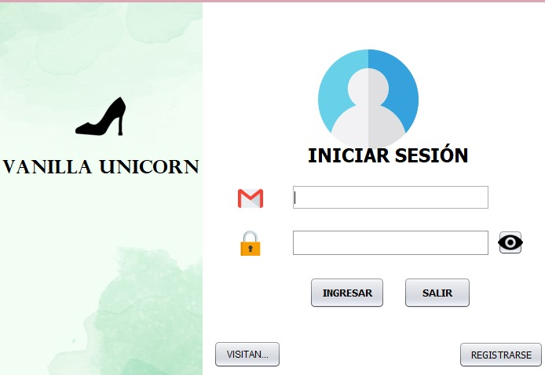

# Proyecto-final---Zapater-a-Vanilla-Unicorn

Este repositorio contiene el proyecto final de la asignatura, en el que se crea una interfaz que simulara un punto de venta o un control de almacen

---

## ⚙️ Funcionamiento

Nuestro proyecto consta de 3 4 partes principales:
- Formulario de Login
- Menu para administrador
- Interfaz para cajero
- Vista de un visitante

- ### `LOGIN`
  Aqui se muestra el inicio de nuestro proyecto, donde un usuario previamente registrado hara uso de sus credenciales para ingrsar como `Administrador` o `Cajero`
  Por el contrario, si es un cliente esporadico que esta de visita y quiere ver nuestro catalogo de productos, puede ingresar como `Visitante`
  Al realizar un registro, se genera y manda un correo electronico al correo del usuario registrado con la informacion de sus credenciales de usuario

  Si se desea una persona con la llave de acceso puede hacer el registro de un nuevo usuario desde la parte del `Login`

- ### `Menu Principal`
  Esta es la interfaz que se mostrara al ingresar como administrador en la cual se pueden realizar acciones como:
  - Agregar productos
  - Editar productos
  - Agregar nuevos usuarios
  - Editar usuarios ya registrados
  - Cerrar  sesión
 
- ### `Cajero`
  Este es el frame que aparecera al ingresar como un `cajero` en el cual este podra realizar ventas, seleccionando un producto y agregandolo al carrito para despues generar un
  ticket con los objetos comprados y su total

- ### `Visitante`
  Este frame muestra una lista de categorias a escoger, asi como una tabla en donde se muestran todos los productos de la categoria seleccionada, una interfaz simple ya que solo es
  para alguien que desea ver los productos en existencia

---

 ## 🎯 Validaciones

 Nuestro proyecto usa un gran repertorio de validaciones, listadas como las siguientes:
 - Validar el dominio de un correo
 - Validar la composicion de la contraseña
 - Validar que un correo no se repita al momento de un registro
 - Validar la llave de acceso al registrar a un nuevo administrador o al hacer un registro desde la ventana de `Login`

 Tambien hacemos uso de una clase que se encarga de encriptar las contraseñas de lo usuarios para una mayor seguridad al momento de ser subidas a una base de datos

---

 ## 🎯 Importacion de la base de datos con nuestros productos
Para poder hacer uso de la base de datos que compartimos en la carpeta llamada `MySQL` tenemos que ejecutar un administrador de bases de datos, en nuestro caso recomendamos MySQL workbench
Al ingresar a nuestra base de datos llamada "ZAPATERIA" y tener creadas 2 tablas, una para usuarios y otra para los productos, solo necesitamos seleccionar la opcion `Data import`, despues
seleccionamos la segunda opcion para indicar que queremos importar desde un archivo .sql como el que compartimos en este repositorio.
Por ultimo seleccionamos el esquema al que deseamos pasar nuestra informacion y marcar que solo queremos pasar los datos (Drump data only), terminamos haciendo clic en el boton Star import 
y ya podemos hacer uso de los registros previamente cargados

## NOTA IMPORTANTE
Los registros compartidos no cuentan con una imagen del producto, por posibles errores al guardar la ruta, por lo que pedimos ejecutar el programa y realizar las ediciones como adminstrador 
para poder mostrar la imagen correspondiente al producto

---

### Capturas del programa

---

## 🎥 Video de demostración

Puedes ver una muestra en funcionamiento en el siguiente enlace:
https://youtu.be/XDklru3ZMkA

---

## 👤 Autor

Jhonatan Ivan Poblete Hernandez
Omar Konk Pérez Ramirez  

---
